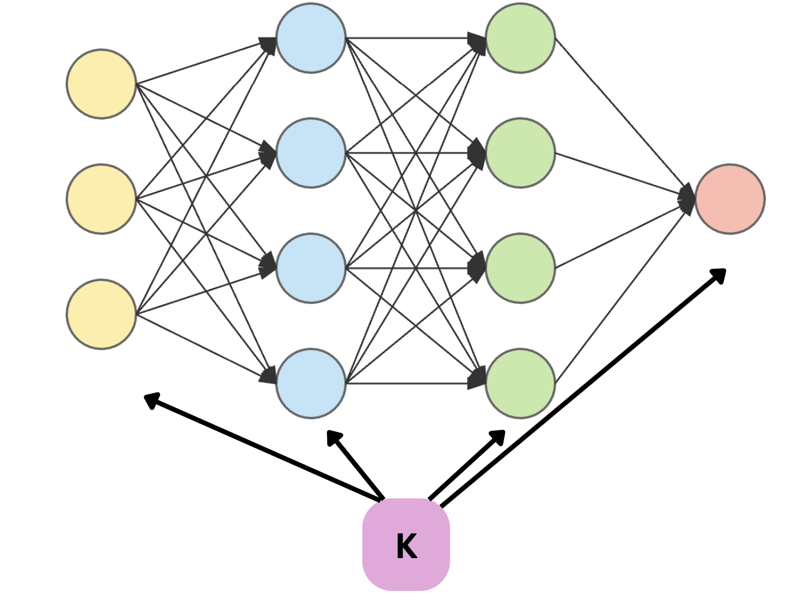

# Knowledge-in-Supervised-Learning

This is the main code repository for the project: **Towards a Universal Expert Knowledge Integration in Supervised Learning**, submitted to the Van der Schaar Lab as part of the recruitment process.

## Abstract:
We investigate the integration of expert knowledge into machine learning models, focusing on supervised learning settings, using simple and intuitive forms such as natural language. Building on the work of **informed meta-learning**, which demonstrated how inductive biases can be implicitly learned in meta-learning, we aim to extend these ideas to the supervised learning paradigm, the paradigm that has demonstrated the highest potential in solving Machine Learning tasks.

## Results reproduction

1- Run the file [simulate_distribution](simulate_distribution.py), after setting the variable `classifier` to `'w_1'` to reproduce the experiment of Figure 2.

2- Run the file [denoising](denoising.py) to reproduce Figure 3.

3- Run the file [accuracy_heatmap](accuracy_heatmap.py) to reproduce Figure 4.

4- Run the file [simulate_distribution](simulate_distribution.py), after setting the variable `classifier` to `'w_2'` to reproduce the experiment of Figure 5.

5- Run the file [accuracy_amazon](accuracy_amazon.py) to reproduce the results of Table 1 on real data.
